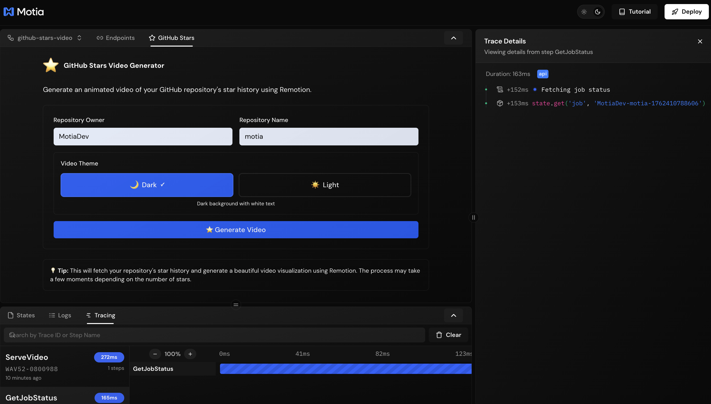

# ⭐ GitHub Stars Video Generator

Generate beautiful animated videos showcasing your GitHub repository's star history using **Motia** and **Remotion**.


---

## 🎬 Features

- **🎨 Dual Theme Support**: Choose between dark and light video themes
- **📹 Live Video Preview**: Watch your video directly in the Motia Workbench
- **⚡ Real-time Processing**: Track generation progress with live status updates
- **🎥 High-Quality Output**: 1280x720 @ 60 FPS with CRF 18 encoding
- **🚀 Smooth Animations**: Beautiful avatar scrolling and star count animations
- **💾 One-Click Download**: Export your video as MP4


---

## 🛠️ Prerequisites

- **Node.js** (v18 or higher)
- **npm** (v9 or higher)
- **GitHub Personal Access Token** (for API access)

---

## 🚀 Quick Start

### 1. **Install Dependencies**

```bash
npm install
```

### 2. **Set Up Environment Variables**

Create a `.env` file in the root directory:

```bash
GITHUB_TOKEN=your_github_personal_access_token_here
```

**How to get a GitHub token:**
1. Go to [GitHub Settings → Developer settings → Personal access tokens](https://github.com/settings/tokens)
2. Click "Generate new token (classic)"
3. Select the `public_repo` scope
4. Copy the generated token

### 3. **Start the Development Server**

```bash
npm run dev
```

The Motia Workbench will open at **http://localhost:3000**

---

## 📖 How to Use

### **Step 1: Open the Plugin**

1. Navigate to **http://localhost:3000**
2. Click on **"GitHub Stars"** (⭐) in the left sidebar

### **Step 2: Configure Your Video**

1. **Enter Repository Details:**
   - Owner: `MotiaDev`
   - Repository: `motia`

2. **Choose Theme:**
   - 🌙 **Dark**: Black background with white text
   - ☀️ **Light**: White background with black text

### **Step 3: Generate & Download**

1. Click **"⭐ Generate Video"**
2. Wait 20-30 seconds for processing
3. **Watch the preview** play automatically
4. Click **"📥 Download Video (MP4)"**

---

## 🏗️ Architecture

### **Built With Motia**

This project uses Motia's event-driven architecture for scalable, asynchronous video generation:

```
┌─────────────────┐
│  Plugin UI      │  ← User inputs repository & theme
└────────┬────────┘
         │
         ▼
┌─────────────────┐
│  API Step       │  ← Validates input, creates job
│  fetchStars     │
└────────┬────────┘
         │
         ▼
┌─────────────────┐
│  Event Step     │  ← Fetches GitHub star data
│  processStars   │
└────────┬────────┘
         │
         ▼
┌─────────────────┐
│  Event Step     │  ← Renders video with Remotion
│  renderVideo    │
└────────┬────────┘
         │
         ▼
┌─────────────────┐
│  Video Served   │  ← Download or preview
└─────────────────┘
```

### **Key Components**

- **Motia Steps**: API routes and event handlers for async processing
- **Remotion**: Programmatic video generation with React
- **Motia Plugin**: Custom UI integrated into Workbench
- **State Management**: Persistent job tracking with Motia state

---

## 📂 Project Structure

```
github-stars-video-motia/
├── steps/
│   ├── github/
│   │   ├── fetchStars.step.ts      # API endpoint to initiate generation
│   │   ├── processStars.step.ts    # Fetch GitHub star data
│   │   ├── renderVideo.step.ts     # Render video with Remotion
│   │   ├── getJobStatus.step.ts    # Get job status
│   │   └── getStarsData.step.ts    # Get cached star data
│   └── videos/
│       └── serveVideo.step.ts      # Serve video files
├── remotion/
│   ├── composition.tsx             # Main video composition
│   ├── schema.ts                   # Remotion props schema
│   ├── Root.tsx                    # Remotion root
│   └── index.ts                    # Entry point
├── plugins/
│   └── plugin-github-stars/
│       └── index.tsx               # Workbench UI plugin
├── public/
│   └── videos/                     # Generated videos stored here
├── motia.config.ts                 # Motia configuration
├── package.json
└── README.md
```

---

## 🎨 Video Themes

### **Dark Theme** 🌙
- Background: `#0a0a0a` (Black)
- Text: `white`
- Perfect for: Modern, sleek presentations

### **Light Theme** ☀️
- Background: `#ffffff` (White)
- Text: `black`
- Perfect for: Professional, bright presentations

---

## ⚙️ Configuration

### **Video Quality Settings**

Edit `steps/github/renderVideo.step.ts`:

```typescript
await renderMedia({
  // ... other options
  crf: 18,              // Lower = higher quality (18 is visually lossless)
  pixelFormat: 'yuv420p', // Standard format for compatibility
  fps: 60,              // Frames per second (smooth animations)
  width: 1280,
  height: 720,
});
```

### **Animation Duration**

Edit `remotion/composition.tsx`:

```typescript
export const animationDurationInSeconds = 3  // Change this value
```

---

## 🐛 Troubleshooting

### **Video Generation Fails**

1. **Check GitHub Token:**
   ```bash
   echo $GITHUB_TOKEN  # Should print your token
   ```

2. **Check Logs:**
   - Open Motia Workbench → "Logs" plugin
   - Look for errors in the "RenderVideo" step

3. **File Permissions:**
   ```bash
   chmod -R 755 public/videos
   ```

### **Video Preview Doesn't Load**

1. **Check if video exists:**
   ```bash
   ls -lh public/videos/
   ```

2. **Test direct access:**
   ```bash
   curl -I http://localhost:3000/videos/[your-video-filename].mp4
   ```

3. **Clear browser cache** and refresh

---

## 📦 Scripts

| Command | Description |
|---------|-------------|
| `npm run dev` | Start development server |
| `npm run build` | Build Motia steps |
| `npm run start` | Start production server |
| `npm run generate-types` | Generate TypeScript types |

---

## 🤝 Contributing

Contributions are welcome! Please feel free to submit a Pull Request.

---

## 📄 License

MIT License - feel free to use this project for your own repositories!

---

## 🙏 Acknowledgments

- **[Motia](https://motia.dev)** - Event-driven workflow framework
- **[Remotion](https://remotion.dev)** - Video generation library
- **[GitHub API](https://docs.github.com/en/rest)** - Repository data
- Inspired by [github-stars-video](https://github.com/scastiel/github-stars-video)

---

## 📞 Support

If you encounter any issues or have questions:

1. Check the **Troubleshooting** section above
2. Review Motia logs in the Workbench
3. Check [Motia Documentation](https://motia.dev/docs)
4. Check [Remotion Documentation](https://remotion.dev/docs)

---

**Made with ❤️ using Motia and Remotion**
